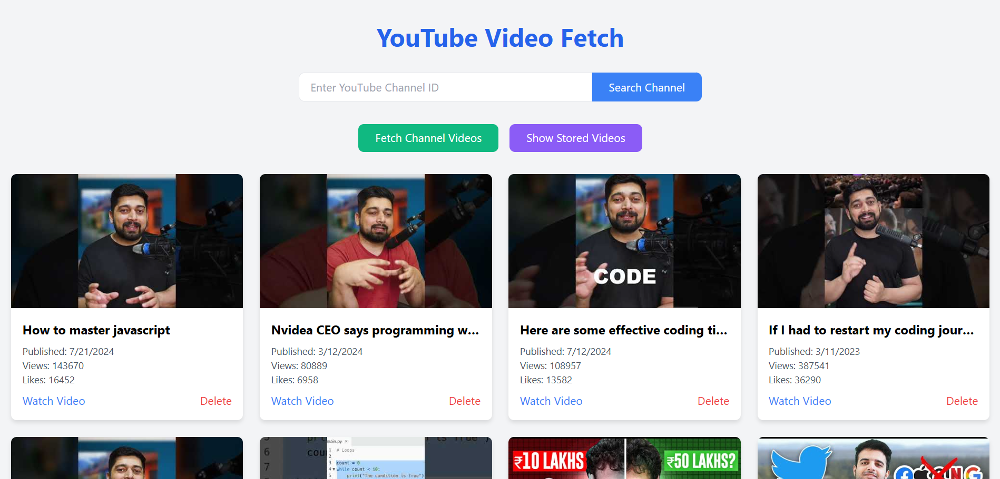

# 📹 YouTube Video Fetch 

Welcome to **YouTube Video Explorer & Manager**! This full-stack application allows users to explore YouTube videos by channel, fetch videos dynamically using the YouTube API, and manage video data in a local database. Users can store, view, and delete videos from the database through a simple and intuitive interface.

## 🚀 Features

- **Fetch Videos by Channel**: Enter a YouTube Channel ID to fetch videos dynamically.
- **Popular Channels**: Preloaded list of popular tech channels for quick exploration.
- **Store Videos**: Save video details in a local MongoDB database.
- **View Stored Videos**: View all stored videos with thumbnails and stats.
- **Delete Videos**: Remove videos from the database.

---

## 🖼️ Demo

### 💻 Screenshot


### 🎥 Demo Video

https://github.com/user-attachments/assets/b8171805-a148-4f1c-af37-6863640de492


---

## 🛠️ Tech Stack

- **Frontend**: HTML, Tailwind CSS, JavaScript
- **Backend**: Node.js, Express.js
- **Database**: MongoDB
- **API**: YouTube Data API

---

## 📂 Project Structure

```
project/
│
├── backend/
│   ├── app.js  # Express server with routes
│   └── models/ # Mongoose models
│
├── frontend/
│   ├── index.html  # Main interface
│   └── assets/     # Static assets (CSS, JS)
│
└── README.md
```

---

## ⚙️ Setup Instructions

### Prerequisites

- Node.js & npm installed
- MongoDB installed and running locally
- A valid **YouTube Data API Key**

### Backend Setup

1. Clone the repository:
   ```bash
   git clone https://github.com/Mahesh7741/your-repo.git
   cd your-repo/backend
   ```

2. Install dependencies:
   ```bash
   npm install
   ```

3. Update the MongoDB URI in `app.js` (if necessary):
   ```javascript
   const mongoURI = 'mongodb://localhost:27017/youtubeVideos';
   ```

4. Run the backend server:
   ```bash
   node app.js
   ```
   The server will be running at `http://localhost:3000`.

### Frontend Setup

1. Navigate to the `frontend` folder:
   ```bash
   cd ../frontend
   ```

2. Open `index.html` in your browser:
   ```bash
   open index.html
   ```

3. Replace the `[APIKEY]` placeholder in `index.html` with your YouTube Data API Key:
   ```javascript
   const apiKey = '[APIKEY]';
   ```

---


# YouTube Video Explorer & Manager

Welcome to **YouTube Video Explorer & Manager**! This full-stack application allows users to explore YouTube videos by channel, fetch videos dynamically using the YouTube API, and manage video data in a local database. Users can store, view, and delete videos from the database through a simple and intuitive interface.

## 🚀 Features

- **Fetch Videos by Channel**: Enter a YouTube Channel ID to fetch videos dynamically.
- **Popular Channels**: Preloaded list of popular tech channels for quick exploration.
- **Store Videos**: Save video details in a local MongoDB database.
- **View Stored Videos**: View all stored videos with thumbnails and stats.
- **Delete Videos**: Remove videos from the database.
### 🎥 Demo Video
[](Assets/20241206234201.mp4)

### 💻 Screenshot


## 🛠️ Tech Stack

- **Frontend**: HTML, Tailwind CSS, JavaScript
- **Backend**: Node.js, Express.js
- **Database**: MongoDB
- **API**: YouTube Data API


## 📂 Project Structure

```
project/
│
├── backend/
│   ├── app.js  # Express server with routes
│   └── models/ # Mongoose models
│
├── frontend/
│   ├── index.html  # Main interface
│   └── assets/     # Static assets (CSS, JS)
│
└── README.md
```

---

## ⚙️ Setup Instructions

### Prerequisites

- Node.js & npm installed
- MongoDB installed and running locally
- A valid **YouTube Data API Key**


### Backend Setup

1. Clone the repository:
   ```bash
   git clone https://github.com/Mahesh7741/your-repo.git
   cd your-repo/backend
   ```

2. Install dependencies:
   ```bash
   npm install
   ```

3. Update the MongoDB URI in `app.js` (if necessary):
   ```javascript
   const mongoURI = 'mongodb://localhost:27017/youtubeVideos';
   ```

4. Run the backend server:
   ```bash
   node app.js
   ```
   The server will be running at `http://localhost:3000`.

### Frontend Setup

1. Navigate to the `frontend` folder:
   ```bash
   cd ../frontend
   ```

2. Open `index.html` in your browser:
   ```bash
   open index.html
   ```

3. Replace the `[APIKEY]` placeholder in `index.html` with your YouTube Data API Key:
   ```javascript
   const apiKey = '[APIKEY]';
   ```

---
## 🧪 Usage

### 1. Fetch Videos
- Enter a YouTube Channel ID and click **Search Channel**.
- Or click **Fetch Channel Videos** to explore videos from popular tech channels.

### 2. Manage Videos
- Click **Show Stored Videos** to view all saved videos.
- Use the **Delete** button to remove a video from the database.

---

## 🌟 Key Features in Code

### Backend Highlights
- **Express.js** for routing and API endpoints.
- **MongoDB + Mongoose** for database integration.
- CORS setup for secure cross-origin requests.

### Frontend Highlights
- **Tailwind CSS** for a responsive and modern UI.
- Dynamically fetch and render videos using the **YouTube Data API**.
- User interactions with intuitive buttons and hover effects.

---


## 🤝 Contributions

Feel free to contribute! Open issues, create pull requests, or suggest improvements. Together, we can make this project better. 😊

---


## 📝 Acknowledgments

- YouTube Data API for enabling video fetching.
- Tailwind CSS for fast and beautiful styling.
- MongoDB for seamless data storage.
```

### How to Save
1. Create a new file in your project directory called `README.md`.
2. Copy and paste the above content into the file.
3. Save it. 🎉

Now your project has a professional README file ready for GitHub or any other platform!


